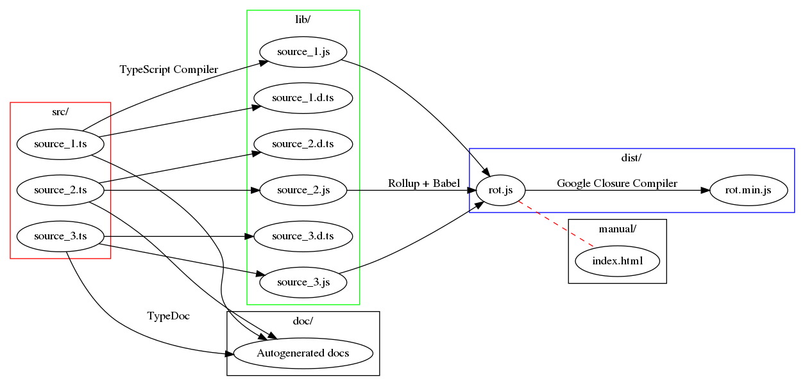

# rot.js

ROguelike Toolkit in JavaScript. For more info, see https://ondras.github.io/rot.js.

## Library

There are multiple ways of including rot.js in your project.

### Downloading

You can get rot.js using either of these methods:

  - clone this repository to gain full source code access;
  - `npm install rot-js`;
  - download the [prebuilt rot.js file](dist/rot.js) (or the [minified rot.min.js file](dist/rot.min.js)) to include it in your project.

### Usage

Rot.js is written in TypeScript, but its code is available in multiple formats. You can pick the one that best suits your development needs.

  1. The `lib/` directory contains the code in [ES2015 modules](https://developer.mozilla.org/en-US/docs/Web/JavaScript/Reference/Statements/import). These can be used in modern browsers directly, without any transpilation/bundling step. An [example](examples/native-modules/) shows how to do that.

  1. For practical reasons, individual modules should be bundled to make your application more compact. You are free to use any bundler that understands ES2015 modules. If you want to support older browsers, you should also transpile your code -- there is [an example using babel and rollup](examples/bundled-modules/) that shows how to do that. This is the recommended way of using rot.js.

  1. If you do not fancy modern modules and/or transpilation, you can grab a [pre-built bundle](dist/rot.js) and include it in your page using traditional `<script>` tag. This bundle puts rot.js into a global `ROT` namespace and uses ES5 (supported even by older browsers). See an [example](examples/dist/) of this approach.

  1. Finally, the pre-built budle also comes with [a minified version](dist/rot.min.js) that works the same, but its size has been reduced. The usage is the same as in the previous example.

## Node.js

Most parts of rot.js are usable from within node.js (server-side JavaScript). The `Display` class needs to use the `"term"` layout backend:

```js
let display = new ROT.Display({width:40, height:9, layout:"term"});
display.draw(5,  4, "@");
display.draw(15, 4, "%", "#0f0");          // foreground color
display.draw(25, 4, "#", "#f00", "#009");  // and background color
```

### Usage

The pre-bundled rot.js package can be loaded as a CommonJS module. There is an [example](examples/node/) that shows basic usage.

## Contributing

ROguelike Toolkit is largely considered "feature-complete", but bugfixes, documentation, and some new features are welcomed. Development should happen in the `/src` folder, and then the build process creates the `/lib`, `/dist`, and `/doc` folders before serving the project.



The command to rebuild everything:

```sh
npm install
make all
```

## Misc

RogueBasin page (with links to some rot.js-based games): http://roguebasin.com/index.php/Rot.js
